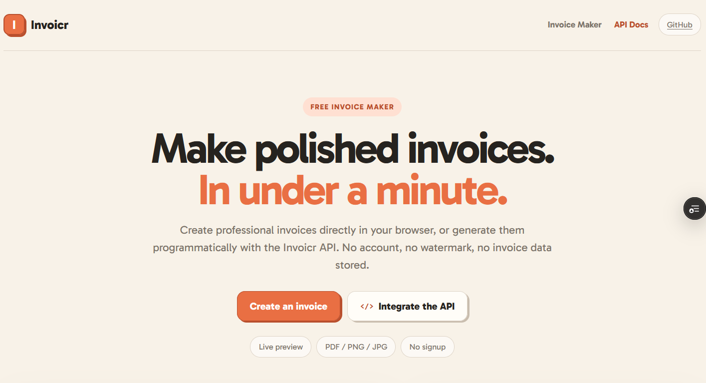

<div align="center">

# Invoicr

### Make polished invoices. In under a minute.

A fast, privacy-friendly invoice maker and stateless invoice API.  
Create professional invoices in your browser or generate them programmatically — no account, no watermark, no invoice data stored.

[**Open Invoicr →**](https://try-invoicr.vercel.app/) · [**API Docs →**](https://try-invoicr.vercel.app/docs) · [**⭐ Star on GitHub**](https://github.com/ennouaimi/invoicr)

<br />



</div>

---

## ✦ Why Invoicr?

**Invoicr** is designed to keep invoice generation simple. Use the visual editor when you need an invoice now, or call the API when your product needs to generate one automatically.

|                          |                                    |
| ------------------------ | ---------------------------------- |
| ⚡ **Instant**           | Live preview while you edit        |
| 🔒 **Private by design** | Invoice data isn't stored          |
| 🧾 **Professional**      | Clean A4 invoice layout            |
| 📦 **Multiple exports**  | PDF, PNG and JPG                   |
| 🌍 **Flexible**          | EUR, USD, GBP and MAD              |
| 🔌 **API-ready**         | Generate invoices programmatically |
| 🚫 **No signup**         | Open it and start creating         |
| 💧 **No watermark**      | Your invoice stays yours           |

## ✦ Invoice Maker

Add your business and customer details, line items, taxes, discounts, payment method and logo. The preview updates instantly and can be exported when you're ready.

> **Local-first:** the browser invoice maker processes your invoice data locally.

## ✦ Invoice API

The API is stateless: send invoice data, receive the generated result.

```http
POST /api/v1/invoices?format=pdf
Content-Type: application/json
```

### Quick start

```bash
curl -X POST "https://try-invoicr.vercel.app/api/v1/invoices?format=pdf" \
  -H "Content-Type: application/json" \
  -d '{
    "merchant": {
      "name": "Northstar Studio",
      "address": "San Francisco, CA"
    },
    "invoiceNumber": "INV-1001",
    "date": "2026-09-20",
    "currency": "USD",
    "items": [
      {
        "name": "Design services",
        "quantity": 1,
        "unitPrice": 250
      }
    ],
    "tax": { "rate": 8.5 },
    "payment": { "method": "Card" },
    "note": "Thank you for your business!"
  }' \
  --output invoice.pdf
```

### Response formats

| Format   | Query          | Use case                                   |
| -------- | -------------- | ------------------------------------------ |
| **PDF**  | `?format=pdf`  | Downloadable A4 invoice                    |
| **HTML** | `?format=html` | Render in a browser or application         |
| **JSON** | `?format=json` | Validated invoice data + calculated totals |

Full examples for cURL, JavaScript and Python are available in the [API documentation](https://try-invoicr.vercel.app/docs).

## ✦ Tech Stack

Built with **Next.js**, **TypeScript**, **React**, **jsPDF**, **html-to-image** and **pdf-lib**. The MVP doesn't require a database.

## ✦ Run locally

```bash
git clone https://github.com/ennouaimi/invoicr.git
cd invoicr
npm install
npm run dev
```

Then open `http://localhost:3000`.

## ✦ Project philosophy

Invoicr focuses on three things: **speed, privacy and simplicity**. The invoice maker doesn't require an account, while the API remains stateless so invoice generation doesn't require storing customer documents.

---

<div align="center">

**[Create an invoice](https://try-invoicr.vercel.app/)** · **[Read the API docs](https://try-invoicr.vercel.app/docs)**

Built for people who just want to make an invoice and move on.\n\n**Like Invoicr?** [**Give the project a ⭐**](https://github.com/ennouaimi/invoicr) **to support it and help others discover it.**  

</div>

## License

MIT
